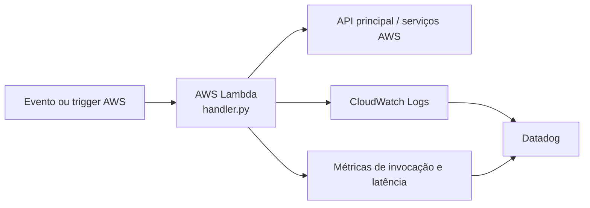

# Oficina Mecânica | Lambda serverless

Função AWS Lambda responsável por processamento orientado a eventos e integrações assíncronas da solução.

## Visão geral

| Item | Informação |
| --- | --- |
| Responsabilidade | Processamento de eventos e integrações assíncronas |
| Runtime | Python 3.12 |
| IaC/deploy | AWS SAM |
| Ambientes | `homologacao` e `production` |
| Pipeline | [GitHub Actions](.github/workflows/ci-cd.yml) |
| Estado operacional | Operacional quando a função está `Active` e os triggers estão habilitados |

## Arquitetura geral



## Stack e componentes

- Python 3.12
- AWS Lambda
- AWS SAM
- boto3
- GitHub Actions
- Datadog para logs, métricas e alertas

## Status operacional e endpoints

| Verificação | Acesso |
| --- | --- |
| Estado da função | AWS Console ou `aws lambda get-function` |
| Logs | CloudWatch Logs |
| Invocação direta | `aws lambda invoke` |
| Swagger da API | Não se aplica: este repositório não publica API HTTP |
| URL pública | Somente se o template criar API Gateway; consultar outputs do stack |

A API HTTP principal e seu Swagger estão no repositório [PosTechFiap_Mecanica_app-k8s](../PosTechFiap_Mecanica_app-k8s/README.md).

## Deploy e acesso

### Deploy automatizado

O [pipeline de CI/CD](.github/workflows/ci-cd.yml) instala dependências, executa testes, roda `sam build` e faz deploy em homologação ou produção conforme a branch.

### Deploy manual

```bash
pip install -r requirements.txt
pip install aws-sam-cli
sam build
sam deploy --guided
```

Para um ambiente já configurado:

```bash
sam build
sam deploy --config-env homologacao
```

### Acesso e teste

```bash
aws lambda list-functions --query "Functions[?contains(FunctionName, 'oficina')].FunctionName"
aws lambda invoke --function-name <nome-da-funcao> response.json
```

Se houver API Gateway, a URL de acesso deve ser lida nos outputs do CloudFormation/SAM após o deploy. Não há URL pública fixa versionada neste repositório.

## CI/CD e configuração

Secrets esperados: `AWS_ACCESS_KEY_ID`, `AWS_SECRET_ACCESS_KEY` e `AWS_REGION`. Configurações específicas da função devem permanecer no `template.yaml` sem incluir credenciais.

## Observabilidade

- `oficina.lambda.requests`;
- `oficina.lambda.latency_ms`;
- erros, timeouts e duração da função;
- logs JSON com contexto do evento;
- correlação com API e integrações no Datadog.

## Estrutura do repositório

```text
src/                  Handler da função
template.yaml         Recursos SAM e configuração
requirements.txt      Dependências Python
.github/workflows/    Pipeline de testes e deploy
```

## Segurança e governança

- credenciais AWS somente em secrets do pipeline;
- função com permissões IAM mínimas;
- eventos idempotentes e sem dados sensíveis em logs;
- deploy de produção protegido por Pull Request e checks obrigatórios.
