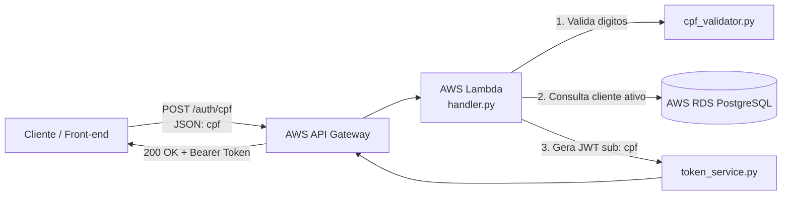

# Oficina Mecânica | Lambda Serverless (Autenticação por CPF + API Gateway)

Função AWS Lambda e **AWS API Gateway** responsáveis pelo ponto de entrada público e pela **autenticação sem senha via CPF** dos clientes da solução Oficina Mecânica.

## Visão Geral

| Item | Informação |
| --- | --- |
| Responsabilidade | Validação de CPF, consulta de cliente no RDS e geração de Access Token JWT |
| Runtime | Python 3.12 |
| IaC / Deploy | AWS SAM (`template.yaml`) + AWS CloudFormation |
| API Gateway | AWS HTTP API Gateway (Stage `prod`) |
| Ambientes | `homologacao` e `production` |
| Pipeline | [GitHub Actions](.github/workflows/ci-cd.yml) |
| Estado operacional | Operacional quando a função está `Active` e o API Gateway responde com 200 |

## Arquitetura de Autenticação



## Endpoints Expostos

| Rota | Método | Descrição | Autenticação |
| --- | --- | --- | --- |
| `/health` | GET | Healthcheck da função e métricas de latência | Pública |
| `/auth/cpf` | POST | Recebe `{"cpf": "..."}`, valida, consulta o cliente no banco e retorna o token JWT | Pública |

> **Documentação Swagger / OpenAPI da API:** Os endpoints protegidos por este token estão documentados via Swagger UI no repositório [PosTechFiap_Mecanica_app-k8s](../PosTechFiap_Mecanica_app-k8s/README.md#status-operacional-e-endpoints-swagger--openapi) na rota `/docs` e `/openapi.json`.

### Exemplo de Uso do Endpoint de Autenticação

```bash
# 1. Solicitar Token via CPF
curl -X POST https://<api-gateway-url>/prod/auth/cpf \
  -H "Content-Type: application/json" \
  -d '{"cpf": "529.982.247-25"}'

# Resposta:
# {
#   "access_token": "eyJhbGciOiJIUzI1NiIsInR5cCI6IkpXVCJ9...",
#   "token_type": "bearer"
# }

# 2. Utilizar o Token nas rotas protegidas da API Principal
curl -H "Authorization: Bearer <access_token>" \
  https://<api-gateway-url>/prod/api/v1/clientes
```

## Configurações e Segredos (AWS SSM Parameter Store)

A função recupera suas configurações de conexão ao banco e chave JWT do **AWS Systems Manager Parameter Store**:

- `/oficina/db/host`: Hostname do RDS PostgreSQL
- `/oficina/db/port`: Porta do banco (`5432`)
- `/oficina/db/name`: Nome do banco (`oficina_db`)
- `/oficina/db/user`: Usuário do banco (`oficina`)
- `/oficina/db/password`: Senha master (SecureString)
- `/oficina/jwt/secret_key`: Chave secreta JWT idêntica à utilizada pela API no EKS (SecureString)

## Estrutura do Repositório

```text
src/
  ├── handler.py          # Entrypoint e dispatcher de rotas (/health e /auth/cpf)
  ├── cpf_validator.py    # Algoritmo de validação de dígitos verificadores do CPF
  ├── db_client.py        # Conexão direta com PostgreSQL (psycopg3) e query de cliente
  └── token_service.py    # Geração de tokens JWT compatíveis com a API principal
tests/
  ├── test_auth_cpf.py    # Testes unitários do fluxo de autenticação por CPF
  └── test_handler.py     # Testes do healthcheck
template.yaml             # Definição do AWS API Gateway e Lambda via SAM
requirements.txt          # Dependências Python (python-jose, psycopg, datadog, etc.)
.github/workflows/        # Pipeline automatizado de testes e deploy
```

## Documentação Arquitetural Completa

Para detalhes sobre o diagrama de sequência, decisões técnicas (RFCs/ADRs) e visão de rede da solução integrada, consulte o documento consolidado:
👉 [`docs/arquitetura.md` no repositório app-k8s](../PosTechFiap_Mecanica_app-k8s/docs/arquitetura.md).
